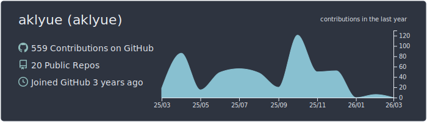
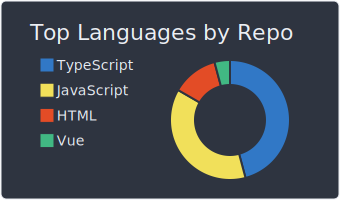
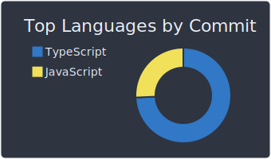
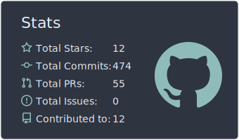
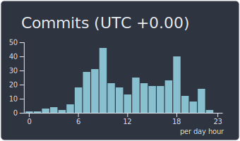

# 👋 Привет!  
Я Frontend/Fullstack разработчик, увлечённый созданием удобных и красивых веб-приложений.  
Люблю React, TypeScript и всё, что связано с вебом 🚀  

---

## 🛠️ Технологии и стек

---

## 📊 GitHub Статистика

---

## ✨ Немного фана

---

## 📫 Контакты
- 📧 Email: olegglapshin@gmail.com
- 🔗 LinkedIn: [aklyue](https://linkedin.com/in/aklyue)
- 💬 Telegram: [@yukino_r](https://t.me/yukino_r)  
- 💼 А ещё здесь в скором времени будет сайт-портфолио.
